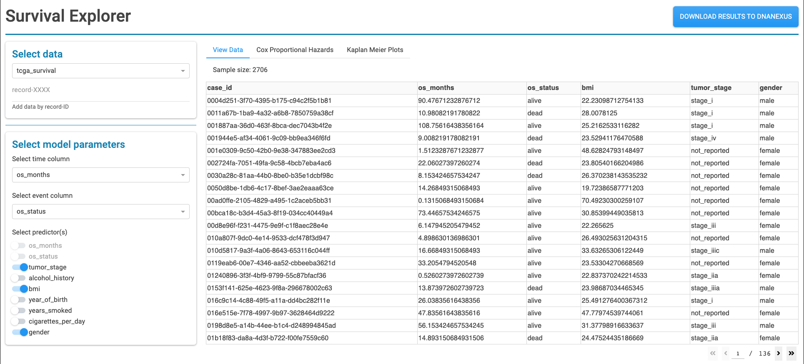
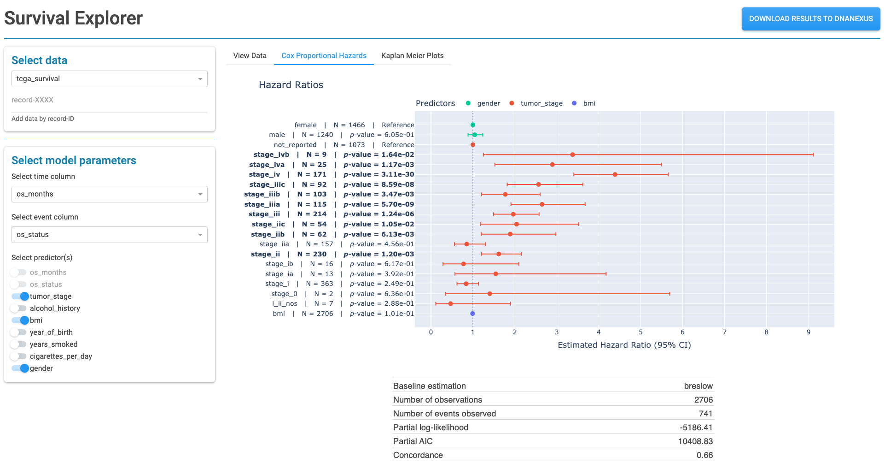
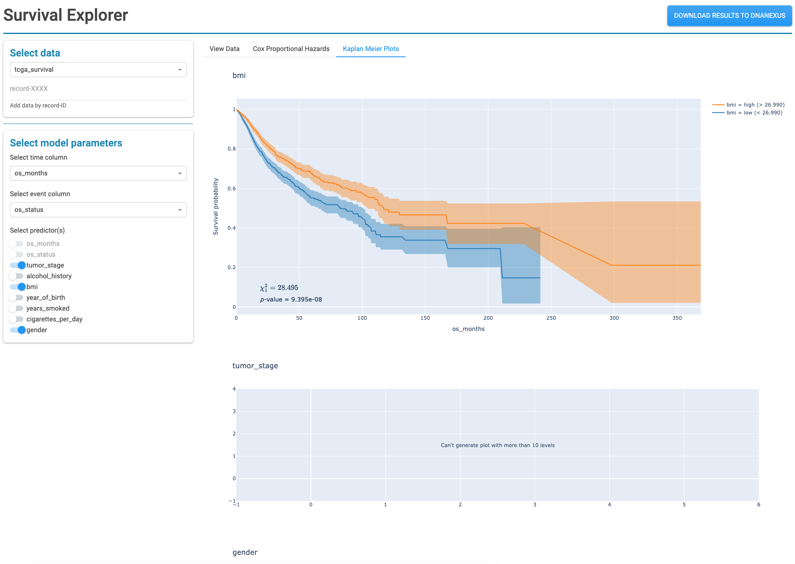

# Survival Explorer

A DNAnexus webapplet made using Dash/Plotly that enables some exploratory survival analysis
(i.e. Cox Proportional Hazards and KM analysis) using only the information contained in Cohort and Dashboard objects

## How to use

- First, the Cohort Browser is used to designate the set of participants (by building a Cohort) and the set of fields (by adding Tiles) for use in survival analysis
- This webapp then takes any number of Cohort or Dashboard objects as input
    - If object has Tiles associated with it, all fields captured in Tiles will be available for use in the webapp.
    - If object has no associated Tiles, only main entity fields will be usable in webapp.
    - Each Cohort or Dashboard object will be treated as a seperate data source, unless `Combine Objects` is set to `True`, in which case all objects will be concatenated and a new field will be usable: "cohort", a categorical variable that serves as an object identifier. **Note**: To use `Combine Objects`, objects to combine must have the same Tiles (or if not using Tiles, the same primary entity fields).
    - **Warning:** If attempting to use a field that maps to participants via a many:1 relationship, only the first value for each participant will be used in the webapp. This is to ensure each data point in the webapp is independent and valid inferences are produced.
- Using only point-and-click methods, the user fits a survival analysis model
    - User simply selects fields to use as the "time-to-event" variable, the "event" variable, and the predictor variable(s).
    - After making selection, the "View Data" tab shows the participants with complete records for all variables selected, and shows the corresponding sample size that is used to fit the model.
    - The "Cox Proportional Hazards" tab provides a forest plot to visualize estimated hazard ratios. Estimates are conditional on all other predictors selected.
    - The "Kaplan Meier Plots" tab provides a KM plot for each predictor. Each predictor is analyzed individually, and a test statistic and p-value is provided reflecting the null hypotheses that curves are equal.

## Screenshots

The "View data" tab where user can inspect the data used to fit the model:

The "Cox Proportional Hazards" tab for viewing Cox PH results:

The "Kaplan Meier Plots" tab for viewing KM plots:
